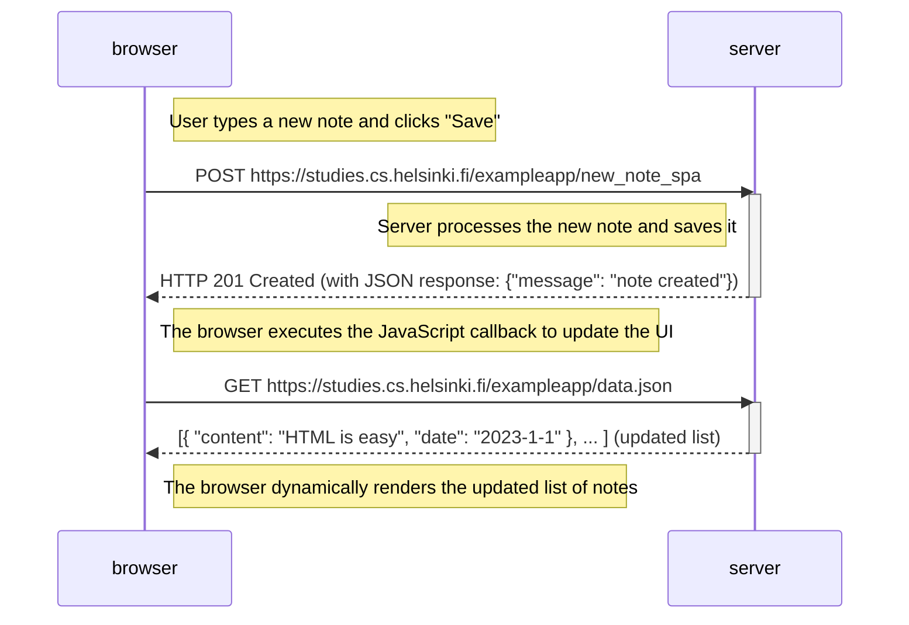

```mermaid
sequenceDiagram
    participant browser
    participant server

    Note right of browser: User types a new note and clicks "Save"

    browser->>server: POST https://studies.cs.helsinki.fi/exampleapp/new_note_spa
    activate server
    Note left of server: Server processes the new note and saves it
    server-->>browser: HTTP 201 Created (with JSON response: {"message": "note created"})
    deactivate server

    Note right of browser: The browser executes the JavaScript callback to update the UI

    browser->>server: GET https://studies.cs.helsinki.fi/exampleapp/data.json
    activate server
    server-->>browser: [{ "content": "HTML is easy", "date": "2023-1-1" }, ... ] (updated list)
    deactivate server

    Note right of browser: The browser dynamically renders the updated list of notes
```
